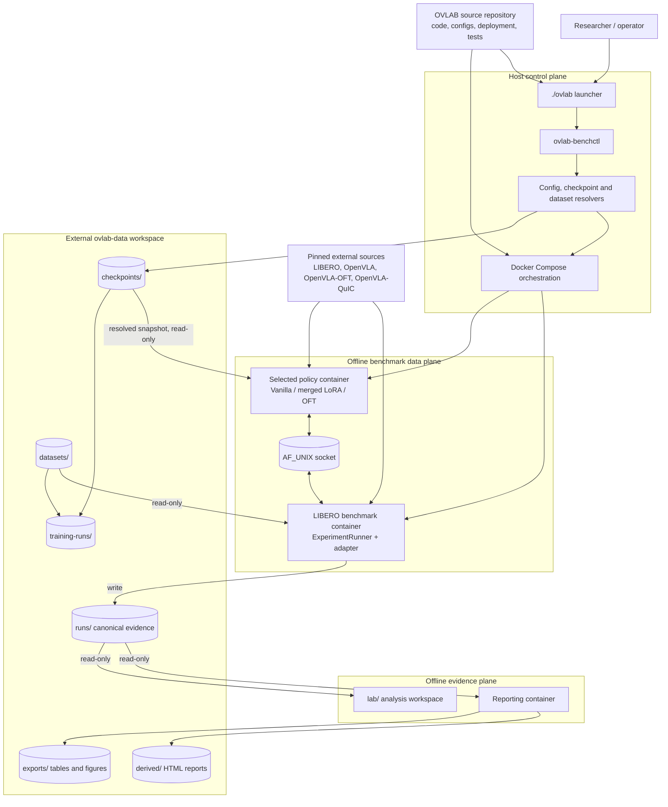
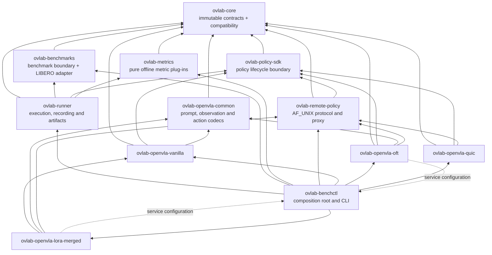
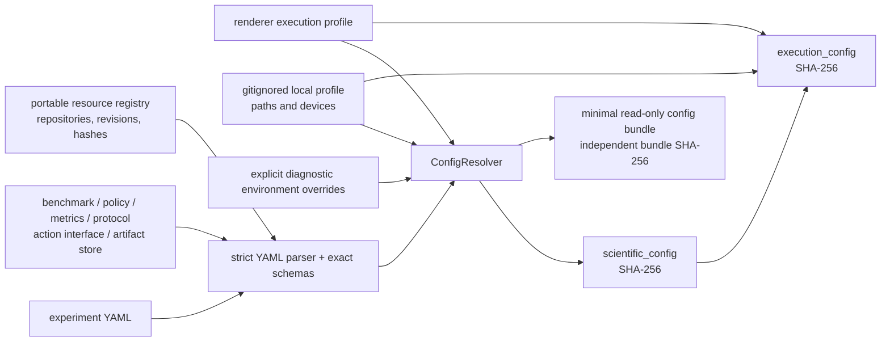
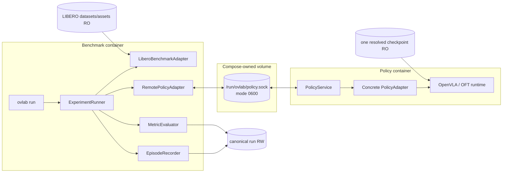
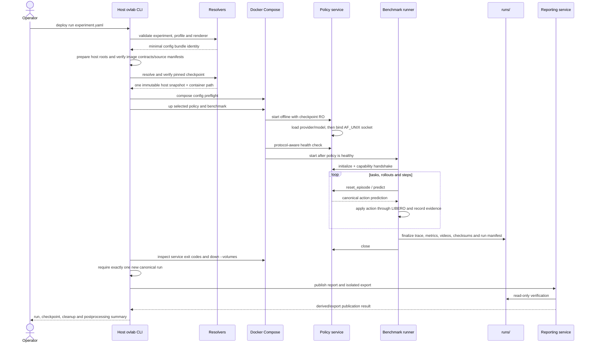
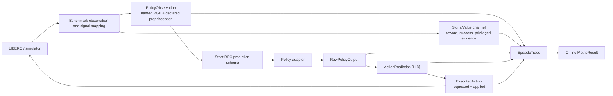
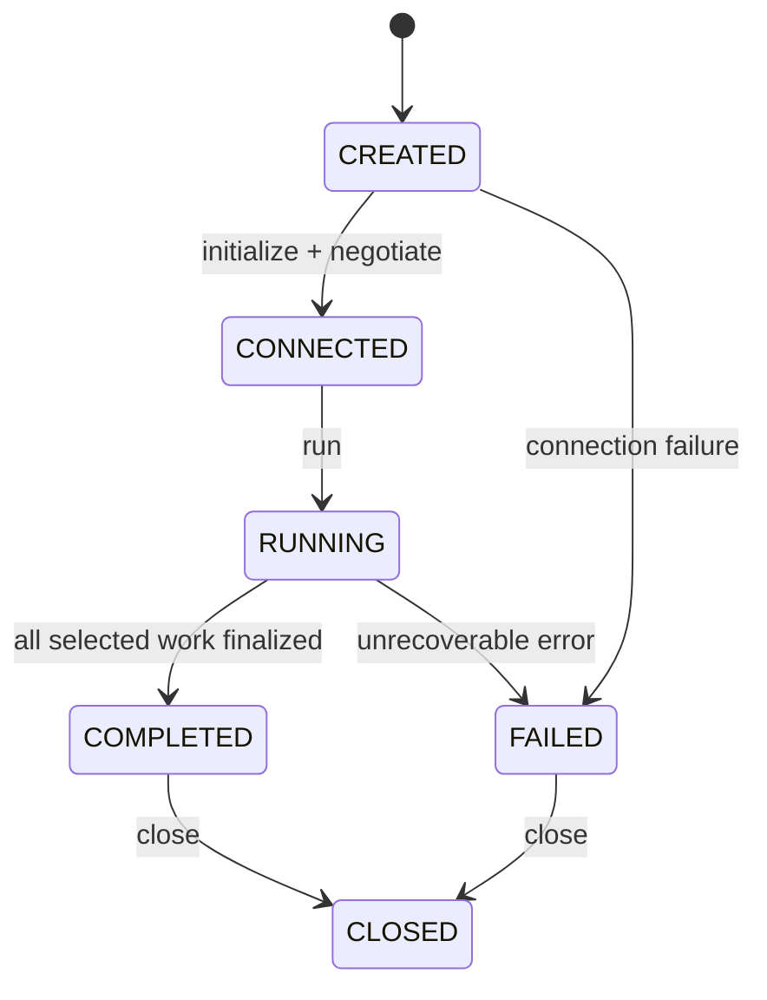
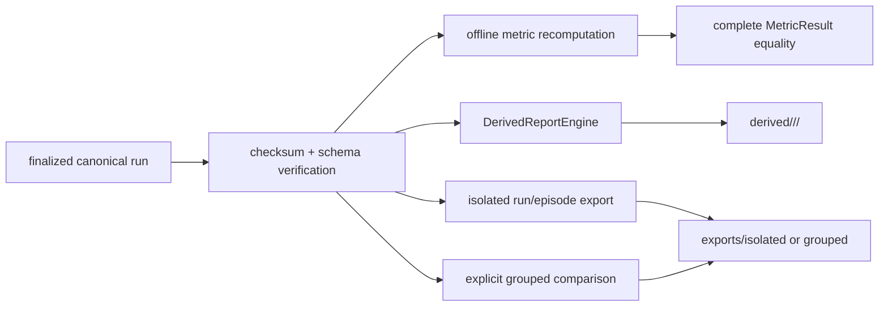
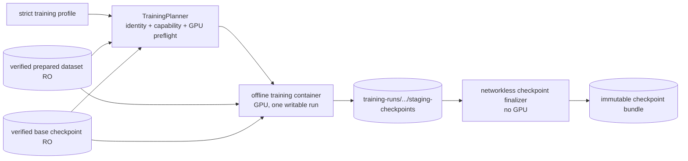

# OpenVLABenchmark architecture

This document describes the architecture of OpenVLABenchmark (OVLAB) 0.2.0 as
implemented in the repository. It covers the control plane, benchmark runtime,
isolated policy services, canonical evidence, offline reporting, dataset
management and training. Configuration, contract and wire-protocol versions are
independent of the product version and are identified explicitly below.

## 1. Design goals

OVLAB is a reproducible experimental framework for evaluating OpenVLA-derived
Vision–Language–Action policies, initially against LIBERO. Its architecture is
driven by six rules:

1. **Scientific identity is portable.** Model, checkpoint, dataset, task, seed,
   action protocol and metric definitions are independent of host paths,
   sockets, GPU indices and container tags.
2. **Incompatible runtimes are isolated.** LIBERO and each policy method may use
   distinct dependency stacks and communicate through a small local protocol.
3. **Policy inputs are least-privileged.** Simulator state, success, reward,
   contacts and other evaluation-only signals cannot enter a policy request.
4. **Canonical runs are write-once evidence.** Raw observations, predictions,
   requested/applied actions, signals, metrics and provenance are finalized with
   checksums before offline consumers read them.
5. **Analysis is downstream.** Reporting and export read canonical runs without
   modifying them; derived products are reproducible and replaceable.
6. **Acquisition is explicit.** Runtime services are offline. Network access is
   granted only to explicit host checkpoint resolution or dataset acquisition.

## 2. System context



The system is divided into three operational planes:

| Plane | Responsibilities | Must not do |
| --- | --- | --- |
| Host control plane | Parse commands, resolve configuration and resources, verify images, construct Compose projects, supervise cleanup | Run the benchmark loop or model inference |
| Benchmark data plane | Negotiate capabilities, execute deterministic episodes, record traces, evaluate metrics, finalize canonical runs | Download resources or depend on a concrete model implementation |
| Offline evidence plane | Verify runs, recompute metrics, generate reports and exports | Change canonical run evidence or start LIBERO/model inference |

Dataset acquisition and training form a fourth, separately invoked pipeline.
They share managed storage with deployment but never run as part of a benchmark.

## 3. Repository and package boundaries

```text
ovlab/
├── code/
│   ├── packages/      dependency-light contracts and reusable boundaries
│   ├── policies/      concrete OpenVLA-family policy adapters and services
│   ├── apps/          CLI composition root and experiment runner
│   └── tests/         unit, contract, integration and marked real tests
├── configs/           portable experiment and component configuration
├── deploy/            Dockerfiles, Compose topology, locks and environments
├── external/          pinned upstream sources and the OpenVLA-QuIC fork
├── lab/               offline exploratory/reusable analysis workspace
└── runs/              optional repo-local development output only
```

The Python packages form a layered dependency graph:



Important ownership rules are:

- `ovlab-core` owns data meaning, not I/O or execution.
- `ovlab-benchmarks` and `ovlab-policy-sdk` are independent peers. Neither
  adapter boundary depends on the other.
- `ovlab-runner` depends only on abstract benchmark/policy boundaries. It has no
  OpenVLA, LIBERO import or transport-specific branch in its rollout loop.
- `ovlab-remote-policy` makes a remote policy look like an ordinary
  `PolicyAdapter`; model-specific code remains behind the service boundary.
- `ovlab-benchctl` is deliberately the top-level composition root. It converts
  YAML documents into owner-defined settings and selects concrete adapters.
- The merged-LoRA and OFT service entry modules currently reuse
  `ConfigResolver` from `ovlab-benchctl`, while the composition root lazily
  imports their adapters. The dotted back-edges in the diagram are real
  integration coupling, not dependencies of the runner loop; a future service
  bootstrap package could remove this cycle.
- The production report engine currently lives in `ovlab-runner` because it
  consumes runner artifacts. `lab/` is a separate research workspace and must
  treat `runs/` as read-only.

## 4. Configuration architecture

Portable experiments are strict YAML documents. An experiment references one
benchmark, policy, metric set, protocol, action interface, artifact store and
resource registry. Reuse is explicit through relative `extends`; mappings
deep-merge, while scalars and sequences replace their parent values.



The resolver rejects unknown keys, duplicate keys, aliases, tags, traversal,
inheritance cycles and incompatible component references. It also verifies the
shared action and observation interfaces before any simulator or model import.

### 4.1 Identity boundaries

| Included in scientific identity | Execution-only | Derived-only |
| --- | --- | --- |
| Experiment identity and tags | Resolved host resource paths | Report profile and template bundle |
| Benchmark suite/tasks and protocol | Docker profile and image/runtime provenance | Report build ID |
| Seeds, rollouts and action-chunk mode | Renderer backend and device | Export selection and template |
| Policy method, checkpoint repository/revision/hashes | GPU/device mapping and socket placement | Plot/rendering implementation |
| Normalization, prompt and action-codec identities | Local machine profile | Derived/output paths |
| Metric IDs, versions and configurations | Config-bundle mount details | Generation timestamps |

The current scientific document contains the composed portable resource
registry. Host paths, renderer settings and device choices are excluded. The
execution document contains the scientific document plus resolved resources and
deployment settings. Reporting configuration is outside both benchmark hashes
and receives its own deterministic derived identity.

`ConfigBundleBuilder` collects only the transitive configuration closure needed
by a deployment, inventories every file with SHA-256, materializes it in a
temporary directory with read-only files and mounts it at
`/opt/ovlab/configs:ro`. Adding a new experiment YAML does not require rebuilding
runtime images.

## 5. Production benchmark topology

Production execution uses two containers selected by the experiment:

- `openvla`: `benchmark-openvla` + `policy-openvla` for Vanilla and merged LoRA;
- `oft`: `benchmark-oft` + `policy-openvla-oft` for native OFT.



The benchmark container never receives model weights. The policy container
never receives LIBERO datasets, simulator state or run storage. Both services
run as UID/GID `10001:10001`, with a read-only root filesystem, dropped Linux
capabilities, `no-new-privileges` and no network. The private socket volume is
removed with the project.

EGL is the unattended renderer. The benchmark process applies `MUJOCO_GL=egl`
and `MUJOCO_EGL_DEVICE_ID` before importing MuJoCo, Robosuite or LIBERO. The GLFW
overlay uses `MUJOCO_GL=glfw`, removes the EGL device variable and mounts the X11
socket read-only; it requires a live display server and is not a headless
replacement for EGL.

## 6. Deployment lifecycle



The host orchestrator owns bounded startup, execution, status inspection and
project-scoped teardown. A benchmark failure does not trigger global Docker
cleanup. A reporting failure is reported after teardown and cannot change the
status or contents of an already completed canonical run.

## 7. Core contracts and information boundary

The central in-memory vocabulary consists of immutable typed objects:

- lifecycle identities: `RunContext`, `TaskContext`, `EpisodeContext`,
  `StepContext` and their validated IDs;
- instructions: authoritative text, source, timestamp and supersession;
- policy observations: named images and named proprioceptive vectors;
- evaluation signals: named values with `policy_visible`, `evaluation_only` or
  `privileged` access;
- actions: `RawPolicyOutput` → `ActionPrediction` → `ExecutedAction`;
- capabilities: benchmark production/acceptance and policy requirements/output;
- `EpisodeTrace`: the finalized episode evidence, separate from metric results.



The RPC protocol is `ovlab-policy-rpc/1.0.0`, transported as canonical JSON in
a four-byte network-order length-prefixed frame over AF_UNIX. It enforces frame
and array size limits, exact keys, request IDs, episode IDs, step freshness,
shape/layout/dtype declarations and duplicate rejection.

Vanilla requests use the original primary-camera-only payload. The extended
schema supports declared named RGB observations and float32 proprioception for
OFT while preserving backward compatibility. Both forms carry only lifecycle
identifiers, the authoritative benchmark instruction and declared policy input.
Reward, success, arbitrary observation metadata, contacts, object poses and
simulator state are not representable in the prediction schema.

The initialization handshake returns capabilities, action specification, model
identity, normalization identity, prompt-template identity, action-codec
identity, runtime/component versions and an optional generic method descriptor.
The runner performs no Vanilla/LoRA/OFT-specific negotiation.

## 8. Runner and episode execution



Connection initializes both adapters, negotiates capabilities, validates the
selected task IDs, resolves metric plug-ins and checks whether the recording
policy can satisfy required metric inputs. An incompatibility prevents reset.

For each selected task and rollout, the runner deterministically derives the
episode seed from the base seed, stable task identity/order and rollout index.
The episode loop is synchronous:

1. reset policy and benchmark with the same `EpisodeContext`;
2. record the initial observation and evaluation signals;
3. obtain a prediction when the execution policy requires replanning;
4. select exactly one action from the prediction horizon;
5. let the benchmark return both requested and actually applied actions;
6. record timing, signals and the next observation;
7. stop on success/failure/truncation or apply the configured error policy;
8. finalize the trace before evaluating and storing metrics.

Supported chunk execution modes are:

| Mode | Behavior |
| --- | --- |
| `RECEDING_HORIZON` | Predict every step and execute element 0 |
| `OPEN_LOOP_CHUNK` | Execute the complete returned horizon before replanning |
| `FIXED_REPLAN_INTERVAL` | Execute at most the configured first `K` actions |

Termination or an instruction change discards pending actions. The trace stores
which chunk offsets were executed and which were discarded. Every applied action
retains its prediction ID and selected chunk index.

Timing is separated into model inference measured and synchronized inside the
policy service, actual RPC round-trip measured by the runner-side proxy, action
application time and complete runner closed-loop step time. None is inferred
from another.

## 9. Policy implementations

| Policy family | Runtime image/profile | Observation contract | Output |
| --- | --- | --- | --- |
| OpenVLA Vanilla | `ovlab-policy-openvla`, `openvla` | Primary HWC uint8 RGB + instruction | Single canonical float32 `[1,7]` action |
| Merged OpenVLA-LoRA | `ovlab-policy-openvla`, `openvla` | Same as Vanilla; method provenance retained | Single action; optional 4-bit runtime loading |
| OpenVLA-OFT | `ovlab-policy-openvla-oft`, `oft` | Primary + wrist RGB, 8-D proprioception, instruction | Native action chunk, horizon 8 |
| QuIC-PEFT / QuIC-WC | Contract/provider skeletons | Descriptor-defined | Experimental; no production Compose profile yet |

`ovlab-openvla-common` owns the prompt, canonical RGB checks, immutable model
source identity and action codecs. Concrete policy adapters load the model once,
preprocess observations, invoke the model and perform the decoded-to-LIBERO
conversion exactly once. The shared LIBERO `ActionSpec` is 7-D normalized
OSC_POSE: translation indices 0–2, axis-angle rotation 3–5 and gripper index 6
with `CLOSED_POSITIVE` convention and bounds `[-1,1]`.

The full-weight Vanilla, merged-LoRA and OFT references are methodologically
distinct. A merged LoRA artifact retains LoRA provenance but has no active PEFT
adapter at inference. Quantized merged-LoRA inference is not an unmerged QLoRA
training result. QuIC descriptors must not be treated as runnable merely because
they can be validated in descriptor mode.

## 10. Canonical artifacts

The filesystem store maps public IDs to safe hashed directory keys and publishes
files through temporary siblings and atomic rename. Existing finalized files are
never overwritten through the store API.

```text
ovlab-data/runs/<experiment>_<YYYY-MM-DD_HH-MM-SS>_<hash>/
├── manifest.started.json
├── source_config.yaml
├── resolved_config.yaml
├── plan.json
├── connection.json
├── tasks/<task-key>/
│   ├── metrics.task.json
│   └── episodes/<episode-key>/
│       ├── trace.json
│       ├── events.jsonl
│       ├── arrays/*.npy
│       ├── trace.finalized.json
│       ├── metrics.episode.json
│       ├── metadata.json
│       ├── video.mp4
│       ├── video.json
│       └── finalized.json
├── integrity.json
├── reports/
│   ├── report.json
│   └── report.txt
└── manifest.completed.json | manifest.failed.json
```

Large arrays are stored as non-pickle `.npy` files referenced by relative path,
shape, dtype and SHA-256. The reader rejects missing, modified or escaping
references. Metrics are stored only after raw trace finalization. Run
finalization generates canonical H.264/AVC `yuv420p` fast-start videos, builds
the whole-run integrity inventory and publishes exactly one final manifest.

`metadata.json` is a human-readable episode index, not a source of truth. It
links back to the trace, metric results and resolved configuration and summarizes
experiment, scenario, environment details where available, mission, model,
checkpoint, timestamps and outcome.

The immutability guarantee is application-level write-once publication plus
complete checksum verification; it does not rely on silently editing files or
on a database transaction.

## 11. Metrics, reporting and exports

`ovlab-metrics` evaluates pure plug-ins from an `EpisodeTrace`. Results include
metric ID/version, scope, status, value, unit, sample count, full typed
configuration and its hash. Expected absence is explicit:

```text
status = unavailable
value  = null
```

For example, collision remains unavailable unless a mapped semantic LIBERO
collision signal exists. The framework does not infer collision from arbitrary
contacts or substitute zero. Task aggregation rejects incompatible identities
instead of mixing them.



The reporting image mounts `runs/` read-only and has write access only to
`derived/` and `exports/`. Derived HTML reports are self-contained and use
interactive SVG charts with labeled axes, cursor inspection, zoom/pan and
descriptive statistics. Report build identity depends on canonical inputs,
profile, templates and renderer implementation.

Isolated exports cover one run or one episode. Grouped exports are created only
on explicit request and can select all runs, the same model or a manual run set.
Both publish metadata and file inventories atomically. They do not become part
of the canonical run.

The `lab/` workspace is reserved for exploratory notebooks and reusable offline
analysis. `lab/src/ovlab_lab/` is the intended home of reusable loaders,
analyses, visualizations and report research; generated lab reports are ignored
by Git.

## 12. Managed data and checkpoint resolution

```text
ovlab-data/
├── checkpoints/
│   ├── huggingface/       verified snapshots managed by OVLAB
│   ├── local/             unpublished/custom artifacts
│   └── checkpoint-*/      finalized training outputs
├── datasets/
│   └── <provider>/<name>/<version>/
├── training-runs/
├── runs/
├── derived/
└── exports/
```

An experiment names a logical checkpoint ID. The portable registry binds that
ID to repository, immutable revision, aggregate digest and file inventory. The
host resolver checks, in order:

1. the global Hugging Face cache;
2. an optional local-profile path;
3. the OVLAB-managed Hugging Face cache;
4. a pinned download into managed storage, unless `--offline` was requested.

Files are verified before Docker starts. Reusable global-cache blobs may be
materialized with hard links rather than copied. The policy container always
sees `/checkpoints/resolved/<checkpoint-id>` and cannot determine the original
host location. Artifact identity affects the scientific hash; discovery source
and host path are execution provenance.

Dataset publication follows a similar identity discipline. A ready dataset is
stored below `<provider>/<name>/<version>`, with exact source revision, content
identity, preparation recipe and per-file hashes in its manifest. Local imports
are copied into controlled storage. Only explicit `dataset fetch` receives
network access; list, inspect, prepare and verify run offline.

## 13. Training architecture

Training is not a benchmark mode and does not write `runs/`.



The host validates the profile, resolves the dataset and base model, checks the
training image role and available GPU resources, then creates a canonical
training-run directory. The trainer has no network, reads the prepared dataset
and base checkpoint read-only and writes only its run/staging directory.

A separate dataset/finalizer image validates staged safetensors and atomically
publishes a content-derived `checkpoint-<32 hex>` bundle. Failed or interrupted
training remains evidence but is not deployable. Current production training
supports the OpenVLA reference full/PEFT schema, with unquantized LoRA as the
implemented PEFT method; QuIC and QLoRA training are outside the current path.

## 14. Reproducibility and security controls

| Concern | Architectural control |
| --- | --- |
| Dependency drift | Pinned Git submodules, base-image digests, Python lock files and source manifests |
| Resource drift | Registry revisions, sizes and SHA-256 verification before use |
| Configuration drift | Strict schemas, explicit composition, two hashes and a config-bundle digest |
| Accidental privileged input | Separate observation/signal types plus an exact RPC schema |
| Action ambiguity | Shared `ActionSpec`, requested/applied split and codec identity |
| Runtime contamination | Separate benchmark, OpenVLA, OFT, reporting, dataset and training images |
| Network dependence | `network_mode: none` for runtime/reporting/training; explicit acquisition only |
| Artifact mutation | Exclusive/atomic writes, finalization markers and whole-run integrity inventory |
| Cleanup leaks | Owned Compose project, bounded lifecycle, close operations and volume teardown |
| Misleading metrics | Typed availability states and complete offline equality comparison |

Contract compatibility is currently `OVLAB_CONTRACT_VERSION = 0.1.0`. Product
and package version is 0.2.0. Changing one does not implicitly change the other.
Persistence schemas, CLI JSON envelopes, config bundles, reports and RPC each
carry their own explicit version.

## 15. Extension points

### Add a benchmark

1. Implement `BenchmarkAdapter` without coupling it to a policy package.
2. Declare stable tasks, observation/action capabilities and a signal registry.
3. Map privileged/evaluation data only to `SignalValue`.
4. Add strict configuration and contract tests.
5. Add a runtime image/profile only if its dependency stack requires one.

### Add a policy method

1. Implement `PolicyAdapter` using the shared core contracts.
2. Reuse `ovlab-openvla-common` prompt, observation and action semantics where
   applicable.
3. Expose a generic method descriptor and immutable checkpoint identity.
4. Serve it through `PolicyService`; do not add model-specific runner logic.
5. Add a Compose profile only after the provider is runnable and validated.

### Add a metric

1. Implement a pure episode or task plug-in with a versioned descriptor.
2. Declare trace/signal/sample requirements and typed configuration.
3. Return an explicit status for missing, insufficient or irrelevant evidence.
4. Register it deterministically and test online/offline result equality.

### Add a report or export

Read only finalized, verified canonical runs. Put reusable production behavior
in the reporting engine and exploratory work in `lab/`. Give templates and
selection rules stable identities; never repair source evidence while rendering.

## 16. Current constraints

- The experiment runner is synchronous and single-policy; it does not schedule
  parallel benchmark workers or resume a partial run.
- Production deployment supports Vanilla/merged-LoRA and OFT profiles. QuIC is
  still an experimental provider/contract boundary rather than a qualified
  Compose topology.
- The reporting implementation is packaged with `ovlab-runner`; the root `lab/`
  tree is currently a structured workspace rather than a second production
  report engine.
- GLFW requires a display server. EGL remains the supported unattended path.
- Real evaluation and training require locally available compatible GPU,
  checkpoint and dataset resources.

## 17. Source landmarks

| Area | Primary implementation |
| --- | --- |
| Public CLI | `code/apps/benchctl/src/ovlab_benchctl/cli.py` |
| Composition and hashes | `code/apps/benchctl/src/ovlab_benchctl/resolver.py` |
| Compose orchestration | `code/apps/benchctl/src/ovlab_benchctl/deployment.py` |
| Checkpoint resolution | `code/apps/benchctl/src/ovlab_benchctl/checkpointing.py` |
| Dataset lifecycle | `code/apps/benchctl/src/ovlab_benchctl/datasets.py` |
| Training ownership | `code/apps/benchctl/src/ovlab_benchctl/training_deployment.py` |
| Core contracts | `code/packages/ovlab-core/src/ovlab_core/contracts/` |
| Capability negotiation | `code/packages/ovlab-core/src/ovlab_core/compatibility.py` |
| LIBERO adapter | `code/packages/ovlab-benchmarks/src/ovlab_benchmarks/libero/` |
| RPC protocol/service | `code/packages/ovlab-remote-policy/src/ovlab_remote_policy/` |
| Runner and episode loop | `code/apps/runner/src/ovlab_runner/runner.py`, `execution.py` |
| Trace persistence | `code/apps/runner/src/ovlab_runner/artifacts/` |
| Metrics | `code/packages/ovlab-metrics/src/ovlab_metrics/` |
| Reporting and exports | `code/apps/runner/src/ovlab_runner/derived.py`, `exports.py` |
| Runtime topology | `deploy/compose/compose.yaml` |
| Portable experiments | `configs/experiments/` |
| Resource identities | `configs/resources/registry.yaml` |
| External source pins | `.gitmodules` and root Git submodule gitlinks |
